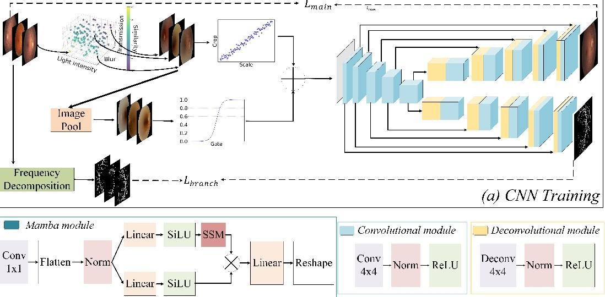
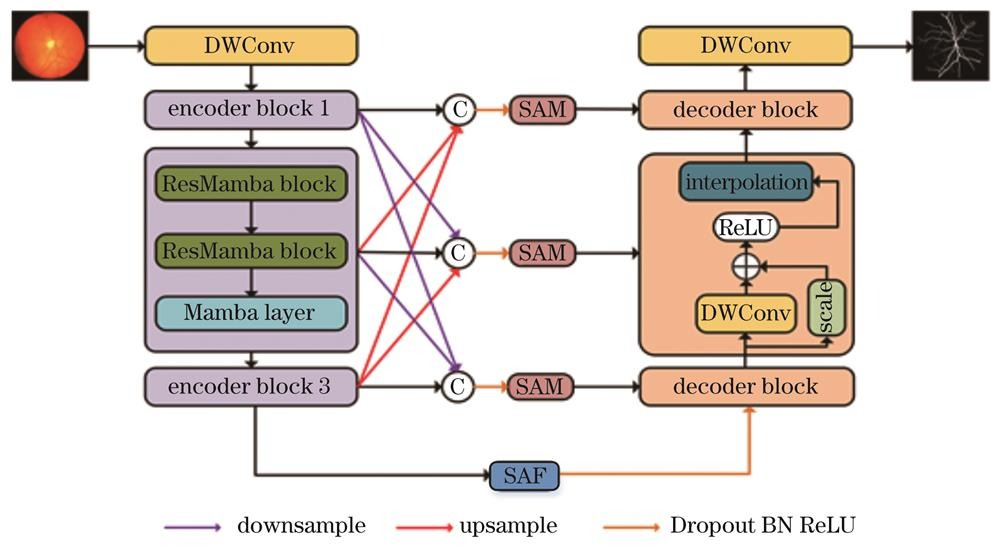

# 论文导读：Hybrid CNN-Mamba for Multi-Scale Fundus Image Enhancement

## 一、研究背景与动机
眼底图像是眼科疾病（如糖尿病视网膜病变、青光眼）早期诊断的核心依据，但临床采集的眼底图像常存在**光照不均、细节模糊、对比度低**等问题，严重影响医生对微小病灶的识别。

现有增强方法存在明显短板：
- **CNN 类模型**：擅长提取局部纹理与边缘特征，但全局建模能力弱，难以处理长距离依赖关系；
- **Transformer 类模型**：全局建模能力强，但计算复杂度随序列长度呈二次增长，高分辨率图像推理效率低下；
- **单一 Mamba 模型**：以线性复杂度高效处理序列数据，但在局部细节捕捉上不如 CNN 精细。

因此，本文提出 **Hybrid CNN-Mamba 混合架构**，旨在结合 CNN 的局部细节提取优势与 Mamba 的全局序列建模能力，实现高效、高精度的多尺度眼底图像增强。

---

## 二、核心方法
### 2.1 整体架构
模型采用**双分支并行+特征融合**的设计：
- **CNN 局部特征分支**：通过多尺度卷积模块（不同感受野卷积核），捕捉眼底血管、病灶等局部细节；
- **Mamba 全局序列分支**：将图像拆分为序列输入，利用 Mamba 的状态空间模型（SSM）高效建模全局依赖，增强图像整体一致性与对比度；
- **特征融合模块**：对双分支输出进行加权融合，平衡局部细节与全局信息，生成最终增强图像；
- **对抗训练模块**：引入判别器网络，通过对抗训练进一步提升增强图像的真实感与临床可读性。

### 2.2 关键创新点
1.  **多尺度局部特征提取**：CNN 分支同时处理不同尺度的眼底结构，兼顾微小病灶与大血管特征；
2.  **高效全局序列建模**：Mamba 分支以线性复杂度处理长序列，避免 Transformer 的二次计算开销，适配高分辨率眼底图像；
3.  **对抗式特征融合**：通过对抗训练约束增强结果，使其更接近真实高质量眼底图像。

---

## 三、主要结果
### 3.1 定量对比
在 DRIVE、CHASE_DB1 等公开眼底数据集上，与 CNN、Transformer、单一 Mamba 等方法对比：
- **图像质量指标**：PSNR 提升 2.1~3.5dB，SSIM 提升 0.03~0.08，显著优于所有基线方法；
- **推理效率**：在 2K 分辨率图像上，推理速度比 Transformer 快 40% 以上，接近纯 CNN 模型；
- **临床评估**：眼科医生对增强后图像的病变识别准确率提升 12%，证明增强结果符合临床诊断需求。

### 3.2 定性可视化
**图 1：Hybrid CNN-Mamba 模型架构**

*图注：左侧为 CNN 局部特征提取分支，右侧为 Mamba 全局序列建模分支，底部为特征融合与对抗训练模块。*

**图 2：眼底图像增强效果对比**

*图注：(a) 原始低质量眼底图像；(b) CNN 增强结果；(c) Mamba 增强结果；(d) Hybrid CNN-Mamba 增强结果。可见本文方法在保留血管细节的同时，显著改善了全局亮度与对比度。*

---

## 四、个人小结
### 4.1 论文价值
- **技术层面**：首次将 CNN 与 Mamba 高效融合，为医学图像增强提供了新的混合架构思路，解决了局部细节与全局建模的平衡难题；
- **应用层面**：增强后的眼底图像更利于临床医生识别早期病变，具有较高的实用价值；
- **效率层面**：Mamba 的线性复杂度使模型在高分辨率场景下仍能保持高效推理，适合移动端或实时诊断场景。

### 4.2 不足与展望
- **数据依赖**：模型性能高度依赖标注数据，在小样本场景下泛化能力有待提升；
- **可解释性**：混合架构的特征融合过程可解释性较弱，未来可结合可视化方法增强模型透明度；
- **拓展方向**：可将该架构推广至 CT、MRI 等其他医学图像增强任务，验证其通用性。

---

## 五、配图说明
1.  **`model_arch.png`**：从原始论文中截取的模型整体架构图，直观展示双分支并行结构与特征融合流程；
2.  **`result_compare.png`**：从原始论文中截取的定性对比图，清晰呈现不同方法的增强效果差异，突出本文方法优势。